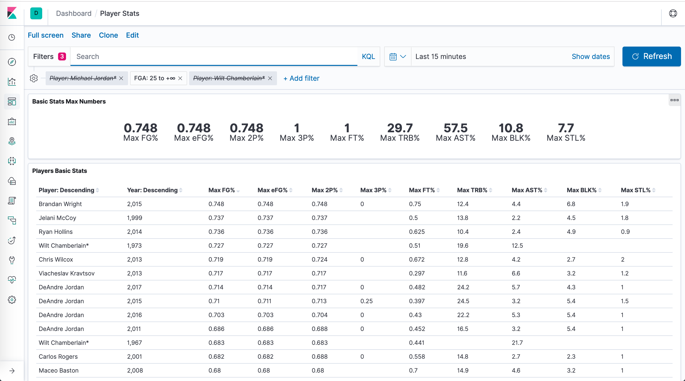

# basket-stats
Basketball stats playground based on Python, ElasticSearch
and Kibana.

Available stuff up to now includes:

* [Scripts](#scripts): available Python scripts.
  * [upload_to_es.py](#upload_to_espy)
  * [card_generator.py](#card_generatorpy)
* [Dashboards](#dashboards)
  * [Kibana 7](#kibana-7)

## Scripts

### upload_to_es.py

Reads seasons stats from CSV file and imports them into 
ElasticSearch. All the data needed is properly stored in
the repo.

Code tested against:
* ElasticSearch 7.0.0
* Kibana 7.0.0

As output the script creates an index named `season_stats`
with information coming from 
[Seasons_Stats.csv](data/nba-players-stats/Seasons_Stats.csv),
ready to be queried and used in Kibana (see 
[mapping](mappings/season_stats.json)).

Some example visualizations built on Kibana 7:


### card_generator.py

Reads a list of players and years (e.g. [draft.csv](draft.csv)) and generates
another CSV with a row per each (player, year, team) and some basic attributes
which values are between 1 and 4 and are based on real stats retrieved from
the ElasticSearch index created using [upload_to_es.py script](#upload_to_espy).

Example:
```
python3 scripts/card_generator.py draft.csv cards.csv

Card Generator v1.0 - Copyright (C) 2019 Alberto Pérez García-Plaza
[Card Generator] Draft read from draft.csv
[Card Generator] Card data available in cards.csv

```

Input file [draft.csv](draft.csv):
```
name,year
Michael Jordan*,1991
Michael Jordan*,1997
Larry Bird*,1986
Larry Bird*,1987
Jason Williams,2001
Jason Williams,2007
Jason Williams,2008
Pau Gasol, 2010
```

Output file [cards.csv](cards.csv):
```
Name,Year,Team,Position,2PT,3PT,DRB,ORB,AST,BLK,STL,SKL
Michael Jordan*,1991,CHI,SG,4,2,3,2,3,3,4,4
Michael Jordan*,1997,CHI,SG,3,3,3,2,3,3,3,4
Larry Bird*,1986,BOS,SF,3,4,3,3,4,3,3,3
Larry Bird*,1987,BOS,SF,4,3,3,2,4,3,3,3
Jason Williams,2001,SAC,PG,3,2,1,1,4,2,3,2
Jason Williams,2007,MIA,PG,3,2,1,1,4,1,3,3
Jason Williams,2008,MIA,PG,2,3,1,1,4,1,3,3
Pau Gasol,2010,LAL,C,4,1,4,3,3,3,1,3
```

## Dashboards

### Kibana 7

#### Player Stats

A [sample dashboard on players stats](dashboards/kibana7/PlayerStats.json)
is included in the repo, ready to be imported into Kibana from
`Management (left hand side vertical menu, last item at the bottom)
 -> Saved Objects -> Import (top right corner, just next to 
 'Refresh')`. 
 
Once imported, it will look like this:

